## 目录
- [Abstract—摘要](#abstract—摘要)
- [一、Introduction—介绍](#一introduction—介绍)
- [二、Related Work—相关工作](#二related-work—相关工作)
- [三、Material and method—材料与方法](#三material-and-method—材料与方法)
  - [3.1 Dataset—数据集](#31-dataset—数据集)
  - [3.2 Preprocessing—预处理](#32-preprocessing—预处理)
  - [3.3 Deep learning models—深度学习模型](#33-deep-learning-models—深度学习模型)
- [四、Experimental results—实验结果](#四experimental-results—实验结果)
  - [4.1 各模型分类性能细节](#41-各模型分类性能细节)
  - [4.2 学习曲线分析](#42-学习曲线分析)
  - [4.3 ROC 曲线与 AUC 分析](#43-roc-曲线与-auc-分析)
  - [4.4 关键性能指标汇总](#44-关键性能指标汇总)
  - [4.5 结果核心结论](#45-结果核心结论)
- [五、Discussion—讨论](#五discussion—讨论)
- [六、Conclusion—结论](#六conclusion—结论)
- [CRedIT authorship contribution statement—作者贡献声明](#credit-authorship-contribution-statement—作者贡献声明)
- [Declaration of competing interest—利益冲突声明](#declaration-of-competing-interest—利益冲突声明)
- [Data availability—数据可用性](#data-availability—数据可用性)
- [References—参考文献](#references—参考文献)

# Abstract—摘要
## 翻译
蚊媒疾病在全球范围内对人类健康构成重大威胁。传统的蚊子物种鉴定形态学和分子生物学方法通常需要专业知识或昂贵的实验室设备。然而，基于深度学习方法（尤其是卷积神经网络，CNNs）的图像式蚊子物种鉴定正逐渐成为一种潜在的替代方案。本研究评估了深度学习方法（特别是卷积神经网络）在蚊子物种分类中的有效性，并对比了躯体图像和翅膀图像的分类性能。研究使用了 3184 个样本，涉及四种形态相似的伊蚊物种（埃及伊蚊、白纹伊蚊、朝鲜伊蚊和日本伊蚊）。数据集按 70% 训练集、15% 验证集和 15% 测试集的比例划分。研究中使用的深度学习模型包括 ResNet50、MobileNetV2、EfficientNetV2、DenseNet、CNN 以及混合模型（CNN + MobileNetV2）。独立的 MobileNetV2 模型在翅膀图像分类中取得了最高准确率（93.3%），而本文提出的混合模型（CNN + MobileNetV2）在躯体图像分类中表现最佳（79.6%）。这些结果不仅显示出高预测准确率，还在各项评估指标中体现出较强的类别区分能力和稳健性。虽然这些发现证明了两种分类方法的潜力，但也凸显了在开发实用且易获取的分类系统时面临的一些实施挑战。研究结果表明，轻量型和混合深度学习架构可作为开发规模化蚊子媒介监测系统的可靠替代方案。

## 解读
摘要高度凝练了研究的核心要素：首先点明研究背景 —— 传统蚊子分类方法的局限性，引出深度学习的应用潜力；明确研究对象（四种形态相似伊蚊）、数据集规模及划分方式；详细列出所用模型及关键结果（MobileNetV2 适配翅膀图像，混合模型适配躯体图像）；最后总结研究价值与应用方向。核心创新点在于**系统对比躯体与翅膀图像的分类效果，并提出针对性的混合模型**，解决了传统方法“专业依赖”和“成本高”的痛点，为规模化监测提供了技术支撑。

# 一、introduction—介绍
## 翻译
蚊媒疾病是热带和亚热带地区最严重的公共卫生威胁之一。全球变暖、森林砍伐、快速城市化和国际贸易增长等大规模环境变化，使得埃及伊蚊和白纹伊蚊等媒介物种能够扩散到此前未受影响的地区。这种扩散不仅加速了病原体的传播，还增加了此前无暴露史或无免疫力人群的感染风险 [23]。世界卫生组织报告称，登革热是伊蚊传播的最常见病毒感染病，威胁着近 40 亿人，每年约有 1 亿例症状性病例和 4 万例死亡。其他蚊媒疾病包括基孔肯雅热、寨卡病毒病、黄热病、西尼罗河热、日本脑炎、疟疾和淋巴丝虫病 [4,14]。

蚊子媒介的准确物种级鉴定对于有效的监测、疫情预测和针对性防控策略至关重要。伊蚊属、按蚊属和库蚊属等不同蚊子属传播不同的病毒和寄生虫病原体（表 1），鉴定错误可能导致防控措施失效。聚合酶链式反应（PCR）等分子技术虽能实现高准确率，但成本高昂、耗时费力，且需要专业实验室设施，不适合大规模或资源有限的场景部署 [16]。

如表 1 所示，伊蚊属、按蚊属和库蚊属蚊子负责传播多种疾病。每个物种都是一系列病毒和寄生虫病原体的传播媒介，凸显了它们在全球公共卫生中的重要作用 [14]。

人工智能（AI）领域的最新进展，尤其是卷积神经网络（CNNs）等深度学习（DL）方法，已实现基于图像的昆虫自动分类，并达到较高准确率 [3,17,24]。这些方法减少了对专业分类学家的依赖，能够快速分类，且可集成到便携式或移动设备中用于野外作业。然而，现有模型存在重要局限性：

- 大多数模型在受控实验室环境中训练和验证，限制了其在多变现实环境中的性能；
- 通常依赖蚊子完整躯体图像，对翅膀等其他形态特征关注较少；
- 图像来源变异（不同设备、光照条件）对模型性能的影响常被忽视。

对翅膀图像的关注不足值得重视，因为蚊子翅膀具有物种特异性的脉序和形状 —— 与完整躯体图像相比，这些特征可能更稳定、更具区分度，尤其是在野外采集样本中躯体受损、不完整或被遮挡的情况下。因此，将翅膀作为主要鉴定特征进行评估，可能开发出更稳健、更实用的监测工具。

已有研究表明，翅膀形态比躯体图像更适合作为分类依据 [15,17]。因此，本研究的创新点并非简单验证这一发现，而是探索**架构效率**：具体研究轻量型模型（如 MobileNetV2）和新型混合架构（CNN-MobileNetV2）是否能在该特定数据集上实现稳健分类，为标准深层模型提供计算成本更低的替代方案。

本研究通过以下方式填补现有研究空白：

（i）使用多种 CNN 架构系统对比躯体和翅膀图像的分类性能；

（ii）提出针对该数据集优化的轻量型混合模型（CNN + MobileNetV2）。

## 解读
引言遵循“背景→问题→现有方案局限→研究目标”的逻辑展开：

1. 以蚊媒疾病的公共卫生威胁切入，用 WHO 权威数据（登革热影响范围、死亡人数）强化研究必要性，同时提及环境变化对蚊子扩散的推动作用，说明分类监测的紧迫性；
2. 强调“准确物种鉴定”与“防控效果”的直接关联，对比分子技术（PCR）的优缺点，引出“低成本、高效分类方法”的需求；
3. 梳理深度学习在昆虫分类中的应用现状，精准指出现有模型的三大核心缺口（环境适应性差、忽视翅膀特征、忽视图像来源变异），为研究定位；
4. 解释翅膀图像的生物学优势（物种特异性脉序、抗躯体损伤），明确本研究与前人的差异 —— 不重复验证翅膀图像的有效性，而是聚焦“模型架构优化”，追求“性能与计算效率的平衡”；
5. 最终明确两大研究任务，为后续实验设计划定范围，逻辑连贯且目标清晰。

# 二、related work—相关工作
## 翻译
表2总结了基于深度学习的蚊子物种分类系统相关文献，按所用方法、数据集细节和实验结果进行整理。此外，这些研究还根据数据集类型（如翅膀图像、躯体图像或混合数据集）进行了分类。

表1 伊蚊属、按蚊属和库蚊属蚊子传播的疾病，凸显其作为多种病毒和寄生虫病原体传播媒介的作用 [14]

| 媒介（属） | 疾病         | 病原类型 |
|------------|--------------|----------|
| 伊蚊属     | 基孔肯雅热   | 病毒     |
|            | 登革热       | 病毒     |
|            | 淋巴丝虫病   | 寄生虫   |
|            | 裂谷热       | 病毒     |
|            | 黄热病       | 病毒     |
|            | 寨卡病毒病   | 病毒     |
| 按蚊属     | 淋巴丝虫病   | 寄生虫   |
|            | 疟疾         | 寄生虫   |
|            | 奥尼翁翁病毒病 | 病毒     |
| 库蚊属     | 日本脑炎     | 病毒     |
|            | 淋巴丝虫病   | 寄生虫   |
|            | 西尼罗热     | 病毒     |

表 2 2020-2024年基于深度学习的蚊子分类相关文献总结，详细列出方法、数据集和关键性能结果

| 作者           | 方法                          | 数据集                          | 性能                          |
|----------------|-------------------------------|---------------------------------|-------------------------------|
| Nolte 等人 [15] | CNN                           | 796 张图像（4 种伊蚊）| 翅膀：87.6%，躯体：78.9%      |
| Araújo 等人 [2] | AlexNet                       | 1343 张图像（4 种）| 准确率 94%                    |
| Johnson 等人 [9]| Mask R-CNN                    | 20 张图像（微观和宏观）| 微观：98.88%，宏观：96.06%    |
| Wang 等人 [21]  | Faster R-CNN                  | 1729 张图像（野外样本）| F1 分数：97.7%                |
| Wang 和 Patel [22] | CNN + RIFS                | 2000 张图像（2 种）| 准确率 98.6%                  |
| Montalbo[13]   | SqueezeNet                    | 3578 张图像                     | 准确率 99.22%                 |
| Gupta 等人 [5]  | CNN                           | 1000 + 张图像                   | 宏观平均召回率 94.4%          |
| Minakshi 等人 [12] | Inception-ResNet V2        | 25867 张图像（250 个样本）| 准确率 80%                    |
| Adhane 等人 [1]  | CNN（迁移学习 + Grad-CAM）| Mosquito Alert 数据集           | 准确率 94%                    |
| Karim 等人 [10]  | Swin-B                        | 5000 张图像（10 种）| 准确率 99.6%                  |

该领域的近期研究表明，卷积神经网络（CNNs）在蚊子物种分类项目中取得了良好效果。Sauer等人证明，CNNs 能够利用躯体和翅膀图像成功区分四种形态相似的伊蚊物种；翅膀数据的准确率为87.6%，躯体数据的准确率为78.9%[17]，其他研究则侧重于通过调整模型以提升性能，例如，He 等人利用深度残差网络（ResNet）结构改进图像识别，为多种蚊子分类系统奠定了基础 [6]。Howard 等人开发了 MobileNet——一种轻量级架构，专为更便携的蚊子分类项目设计，在保证可接受准确率的同时实现了高效计算 [7]。此外，Tan 等人提出的 EfficientNet 等先进架构，用于改进模型缩放并提升准确率 [19]。Huang 等人开发的 DenseNet 架构，即使在现有有限的情况下，也能实现特征连接并增强分类性能 [8]。MobileNetV1 和 DenseNet 等轻量级模型在降低计算负载的同时，展现出具有竞争力的准确率 [7,8]。此外，利用预训练模型的迁移学习技术也取得了显著进展。Singh 等人[18]等研究在预训练 CNN 模型上应用迁移学习进行植物物种分类，并提出类似的迁移学习方法也可有效应用于蚊子物种分类。Gupta 等人 [5] 使用基于 CNN 的 IDX 算法进行蚊子物种分类验证，对来自美国东南部和巴布亚新几内亚的数据集分别实现了 80.2% 和 94.4% 的宏观平均召回率。大规模数据集也得到了应用，例如 Minakshi 等人 [12] 将研究使用 Inception-ResNet V2 架构对 25667 张蚊子图像进行了分类，准确率达到 80%。Adhane 等人 [1] 的预训练模型网络应用于白纹伊蚊分类，准确验证了预训练模型在蚊子图像数据集上的潜力。Karim 等人 [10] 展示的 Swin Transformer 等前沿方法表明，基于视觉 Transformer 的模型能够实现高达 99.6% 的蚊子分类准确率，而 MobileViT 等轻量级模型也达到了 98.9% 的较高准确率。这些研究共同凸显了深度学习在近乎完美分类（尤其是预训练模型）方面的显著进展。此外，轻量级架构、迁移学习方法和创新的 Transformer-based 模型的结合，体现了现实应用的必要性。这些研究共同证明了深度学习结合视觉数据在蚊子物种分类领域取得的显著成就。

尽管取得了这些进展，现有文献仍存在若干关键局限性：大多数研究要么仅关注完整躯体图像，要么涉及较少物种或受控环境下的简单分类任务；直接对比躯体图像与翅膀图像在形态相似伊蚊物种分类中性能的研究较少；此外，探索结合轻量级网络和特征丰富网络优势以实现平衡性能的混合模型架构的研究也不多见。

本研究旨在填补这些空白。通过使用多种深度学习模型（包括新型混合架构 CNN-MobileNetV2）系统对比躯体和翅膀图像的分类性能，研究证明，翅膀图像能产生更优的分类结果，且混合模型可在不牺牲效率的前提下显著提升性能，为自动化媒介监测系统提供了实用且可扩展的方法 —— 尤其是在计算资源有限的野外应用场景中。

## 解读
相关工作部分通过“表格梳理 + 文献评述”的方式，清晰呈现领域研究现状：

1. 表1直观展示蚊子分类与疾病防控的关联，强化“准确分类”的实际意义；表2系统梳理近5年关键研究，从方法、数据集、性能三个维度对比，便于读者快速定位本研究的位置；
2. 文献评述分层展开：先肯定 CNN、ResNet、MobileNet 等主流模型的应用成果，再介绍迁移学习、大规模数据集、Transformer 等前沿技术的进展，最后精准指出现有研究的三大缺口 —— 忽视躯体与翅膀图像的直接对比、缺乏对形态相似物种的研究、混合模型探索不足；
3. 本研究的定位明确：不是重复已有研究，而是针对“形态相似伊蚊”这一更具挑战性的场景，聚焦“躯体 vs 翅膀图像”的系统对比和“混合模型”的创新设计，填补领域空白，同时强调研究的“实用导向”（适配野外计算资源有限的场景）。

# 三、material and method—材料与方法
## 翻译
如图1所示，本研究的整体流程包括四个主要阶段：图像采集与数据集制备、针对蚊子形态的预处理、多种架构模型训练（特征提取、分类）和基于生物学相关性能指标的评估。通过在预处理和训练过程中明确融入翅膀脉序、腿部条纹和盾片标记等形态特征，本研究的方法既符合传统昆虫学鉴定方法，又充分利用了深度学习模型的可扩展性。

<!-- 插入图1，图注自动显示在图片下方 -->

图1. 研究整体流程图，展示从躯体和翅膀图像预处理到模型训练（特征提取、分类）及最终性能评估的全流程

## 3.1 Dataset—数据集
本研究使用 Nolte 等人 [15] 发布的公开图像数据集，该数据集可在 Dryad 数字仓库获取（https://doi.org/10.5061/dryad.b8gbt7mx）。选择该数据集的原因是其高分辨率和标准化特性，这对有效训练深度学习模型至关重要。

最终数据集共包含 3184 张图像，涉及四种蚊子物种：埃及伊蚊（AE）、白纹伊蚊（AL）、日本伊蚊（JA）和朝鲜伊蚊（KO）。为避免训练过程中的类别不平衡问题，数据分布均匀，每个物种各 796 张图像。

每个物种的图像分为两类形态特征：
- 躯体图像：398 张/物种（总计 1592 张）；
- 翅膀图像：398 张/物种（总计 1592 张）。

关于样本来源：埃及伊蚊图像来自美国佛罗里达群岛的野外采集；其他物种（白纹伊蚊、日本伊蚊、朝鲜伊蚊）来自欧洲的实验室种群和监测项目（详见原始数据集说明）。所有照片均在受控实验室环境下使用立体显微镜拍摄，以保证光照和背景的一致性。

## 3.2 Preprocessing—预处理
预处理阶段，所有图像均调整为适配各架构输入要求的尺寸（ResNet/DenseNet 为 224×224，EfficientNet 为 300×300，MobileNetV2 和自定义 CNN 为 384×384）。为提升模型在多变异条件下的泛化能力，同时保留形态完整性，本研究应用了数据增强技术，包括：
- 随机旋转（±15°，模拟样本朝向变化）；
- 随机缩放（±10%，对应放大倍数差异）；
- 水平/垂直翻转（模拟镜像拍摄）；
- 随机平移（±10%，模拟偏心成像）。

像素强度值归一化至 0-1 范围，以保证数据集间对比度一致。为解决类别不平衡问题，训练过程中应用了类别权重，确保少数类别在模型学习中不被低估。

该增强流程通过 TensorFlow 的 ImageDataGenerator 在训练过程中动态应用。所有模型使用相同的增强参数以保证对比的公平性，仅根据各架构的输入要求调整最终目标尺寸（如 224×224、384×384）。

## 3.3 Deep learning models—深度学习模型
所有模型均基于 TensorFlow 2.15 实现，在配备 24GB 显存的 NVIDIA RTX 4090 GPU 上训练。优化器采用 Adam，初始学习率为 \(1 \times 10^{-3}\)，采用余弦衰减调度策略。损失函数使用类别交叉熵，批次大小为 32，训练轮次为 100 轮；基于验证损失采用早停策略（patience=10）以防止过拟合。迁移学习模型使用 ImageNet 预训练权重，初始收敛后解冻最后 20%-30% 的卷积层进行微调，以适配蚊子特有的形态特征。

本研究评估了四种预训练架构（ResNet50、MobileNetV2、EfficientNetB0、DenseNet121）和一种自定义 CNN。自定义 CNN 专为蚊子分类设计，处理 384×384 输入图像，通过三个卷积块（64、128、256 个过滤器；3×3 核），每个卷积块后接批量归一化、ReLU 激活和最大池化，扁平化特征经 256 神经元全连接层（0.3 Dropout）后，输入 Softmax 输出层。该设计聚焦于捕捉与分类鉴定最相关的中等级别纹理和脉序特征。

### 3.3.1 ResNet
ResNet 模型处理 224×224 像素的图像，架构起始为 3×3 窗口的最大池化。第一个卷积层使用 64 个过滤器（7×7）进行初始特征提取，之后输出传递至一系列卷积块。例如，第二层混合使用 64 个（1×1 和 3×3）和 256 个（1×1）过滤器；第三、四、五层延续这一模式，过滤器数量逐步增加至 128/512、256/1024，最终达到 512/2048。这种分层设计使网络能够学习日益复杂的特征。除第一层外，所有 3×3 过滤器的卷积步长均为 [1,1]，采用 “same” 填充以保持空间维度 [6]。

### 3.3.2 MobileNet
MobileNet 专为计算资源有限的环境（如移动设备）设计，注重效率。其处理 384×384 像素的输入图像，速度优势源于深度可分离卷积技术 —— 将标准卷积拆分为两个独立更快捷的步骤。流程起始为 32 个过滤器的传统 3×3 卷积，之后依赖其标志性的深度可分离卷积，再通过 1×1 逐点卷积融合学习到的特征。每层过滤器数量逐步增加（64、128 等），使模型在无需标准 CNN 高额计算成本的情况下构建特征理解。架构最终通过全局平均池化层和全连接层输出分类结果 [7]。

### 3.3.3 EfficientNet
EfficientNet 在平衡高准确率和低计算成本，核心创新是“复合缩放”方法 —— 系统地、均衡地缩放模型的深度、宽度和输入分辨率（通常为 300×300 像素）。基础模型为 EfficientNetB0，在此基础上进行缩放。与 MobileNet 类似，其采用深度可分离卷积降低运算量，起始为 32 个过滤器并逐步增加。这种智能缩放使模型在无需大量硬件资源的情况下实现卓越性能 [19]。

### 3.3.4 DenseNet
密集连接卷积网络（DenseNet）的核心原则是改善网络中信息和梯度的流动，通过将每层直接连接至所有后续层实现这一目标。对于 224×224 输入图像，所有前序层的特征图将被拼接并输入当前层，这一设计鼓励特征复用，形成更紧凑、高效的模型。网络起始为 64 个过滤器，后续层过滤器数量逐步增加（128、256 等）。这种密集连接有助于模型以更少的参数实现高准确率 [8]。

### 3.3.5 卷积神经网络（CNNs）
卷积神经网络（CNNs）是大多数基于图像的深度学习任务的标准架构，专为处理像素网格类数据设计。典型 CNN 处理 384×384 像素输入，通过一系列层对图像进行处理：初始卷积层使用少量过滤器（如 3×3 或 5×5）捕捉边缘或纹理等简单特征；随着数据向网络深层传递，过滤器逐渐学习识别更抽象、复杂的模式。

层间采用池化操作（如最大池化）缩小空间维度，提炼关键信息并降低计算负载。网络最终通过全连接层对高级特征进行处理，输出最终预测结果。

<!-- 插入图4：自定义CNN架构图 -->
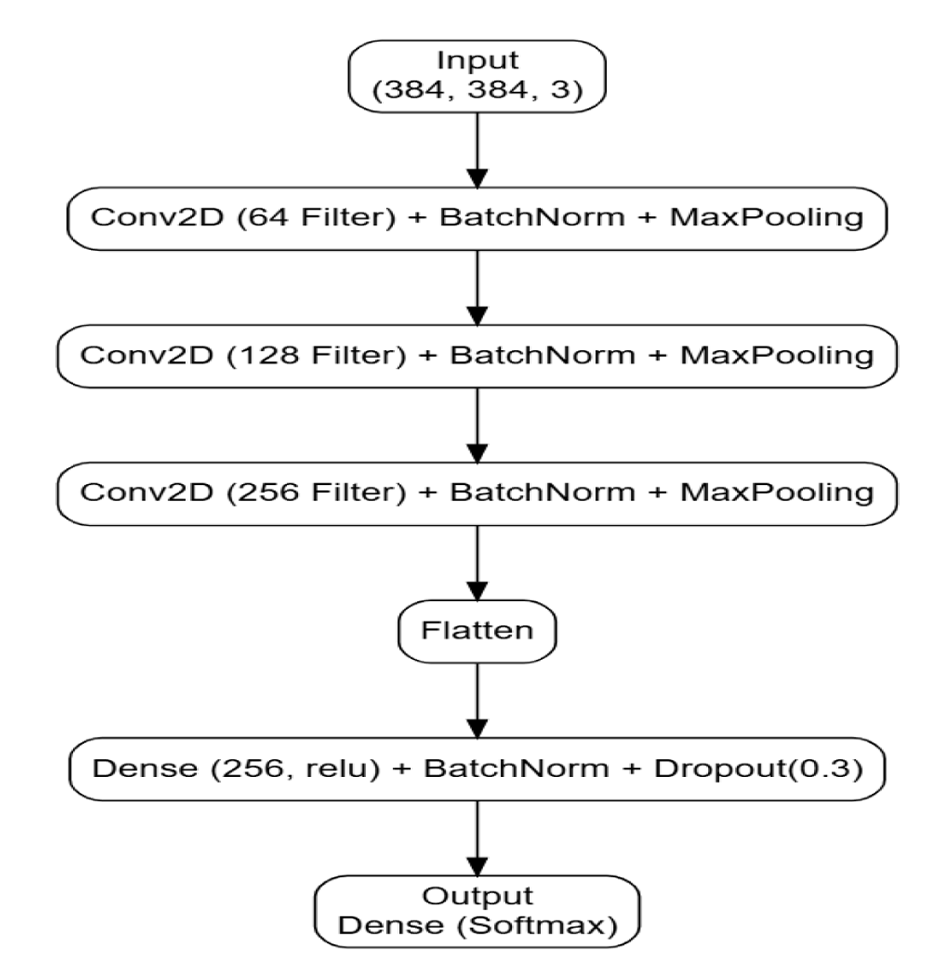

图4. 自定义卷积神经网络（CNN）架构图，展示从384×384输入到三个Conv2D块（64、128、256过滤器）再到最终Dense（Softmax）输出层的流程

如图4所示，本研究的自定义 CNN 架构专为蚊子物种分类设计：模型起始通过三个卷积块处理输入图像，过滤器数量逐步翻倍（64→128→256），这种分层设计使网络能够逐步学习从基础边缘到复杂模式的特征。

为保证训练稳定性并高效降低数据维度，每个卷积层均搭配批量归一化和最大池化操作。核心特征提取完成后，数据被扁平化为一维向量，输入256神经元的全连接层。为防止模型记忆训练数据，引入 Dropout 层（训练过程中随机停用 30% 神经元），迫使网络学习更稳健、泛化能力更强的特征。

架构最终通过 Softmax 激活函数的输出层计算每种蚊子物种的概率，实现清晰分类。

### 3.3.6 混合模型（MobileNet + CNN）
为最大化分类准确率，本研究开发了融合自定义 CNN 和预训练 MobileNetV2 优势的混合模型。该方法不依赖单一架构，而是将每种模型作为专用特征提取器。

混合 CNN-MobileNetV2 模型旨在融合任务特异性特征和通用特征：将 MobileNetV2 的冻结卷积基（经 ImageNet 预训练）与训练后的自定义 CNN 特征提取器融合。两种模型并行处理 384×384 图像，输出特征图拼接形成单一富集特征向量，输入新的全连接分类头（512 神经元、0.5 Dropout、Softmax 激活）。该阶段仅训练分类头，保留两个网络的已有学习成果。消融实验表明，与最佳单一模型相比，该混合设计将分类准确率提升了 3%-5%，尤其在形态相似物种的分类中效果显著。

这种混合策略的核心是融合步骤：通过拼接两种模型的输出，形成比单一模型更全面的富集特征向量；该组合特征集输入由少量全连接层构成的紧凑分类头，仅训练该头使其学习如何最佳解读组合特征，输出高准确率预测。该方法有效结合了自定义 CNN 的专用模式识别能力与 MobileNetV2 的计算效率和通用知识，形成强大、稳健的分类系统 [7,11]。

本研究的建模方法基于生物学相关性：躯体图像中，盾片图案和腿部条纹是关键分类线索；翅膀图像中，脉序交点角度、分支模式和细胞形状至关重要。通过在预处理和训练过程中保留这些形态特征，模型被引导学习与传统昆虫学鉴定标准一致的特征。

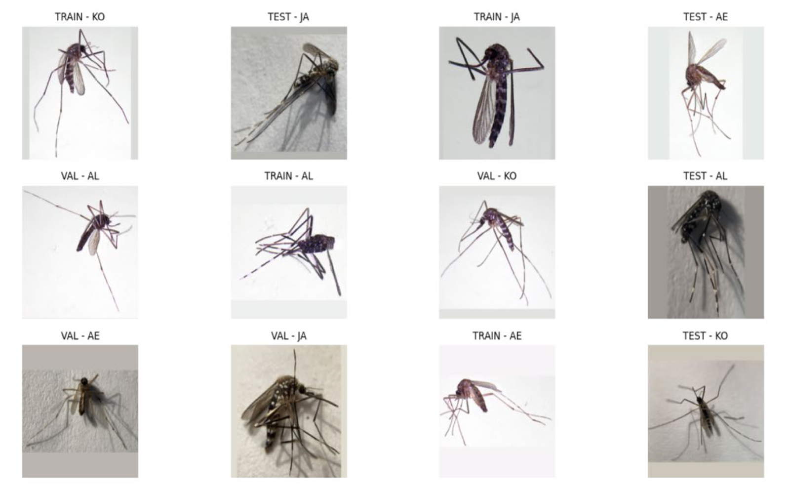

图2. 研究中使用的不同蚊子物种躯体图像，包括埃及伊蚊、白纹伊蚊、朝鲜伊蚊和日本伊蚊（来源：[15]）

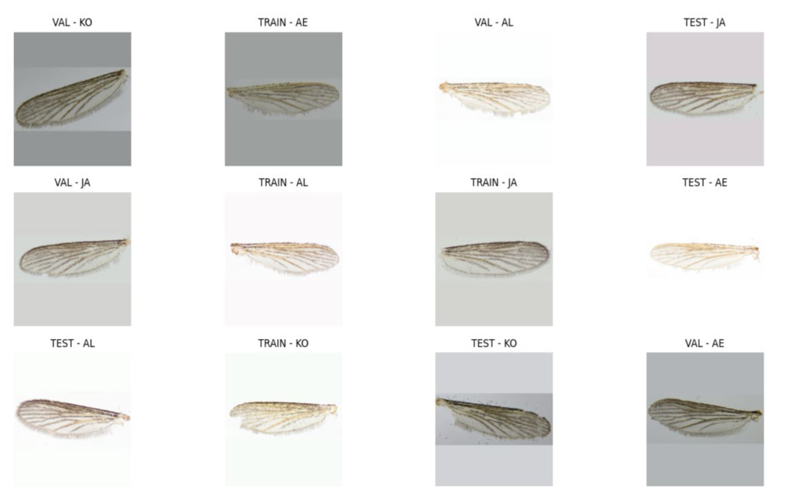

图3. 研究中分析的蚊子物种翅膀图像：埃及伊蚊、白纹伊蚊、朝鲜伊蚊和日本伊蚊（来源：[15]）

# 3. 材料与方法（解读）
本部分是研究的“技术核心”，体现实验设计的严谨性和针对性：

1. 数据集选择：采用公开标准化数据集，样本分布均衡（避免类别不平衡），涵盖野外和实验室样本（增强适用性），明确区分躯体和翅膀图像（契合研究目标），为实验结果的可靠性和可比性奠定基础；
2. 预处理设计：针对蚊子形态特征（脉序、条纹）和野外应用场景（成像条件多变），定制数据增强策略，同时根据不同模型输入要求统一尺寸，保证对比公平性，体现“实用性导向”；
3. 模型选择与设计：
   - 覆盖多类典型架构（经典深层模型ResNet50、轻量型MobileNetV2/EfficientNetB0/DenseNet121、自定义CNN、混合模型），全面对比性能差异；
   - 自定义CNN聚焦蚊子分类核心特征（纹理、脉序），结构简洁且针对性强；
   - 混合模型创新融合“专用特征（自定义CNN）+ 通用特征（MobileNetV2）”，训练策略（仅训练分类头）兼顾性能与效率，是本研究的核心创新点；
4. 训练细节：明确硬件环境、超参数（优化器、学习率、批次大小等）、正则化策略（早停、Dropout、类别权重），保证实验可重复性；同时结合昆虫学知识（聚焦关键形态特征），使模型学习更具生物学意义，提升分类可靠性。

# 四、Experimental results—实验结果
## 翻译
近年来，深度学习和传统机器学习在昆虫、蚊子物种分类等各类图像分类任务中备受关注。已有研究基于图像数据集开发了多种蚊子物种（如埃及伊蚊、白纹伊蚊、朝鲜伊蚊、日本伊蚊）识别的深度学习模型。传统机器学习方法也积极应用于蚊子物种鉴定、分类和生态学研究，为更有效的疾病防控策略提供支持。

本研究应用蚊子图像分类中常用的分类方法，基于躯体和翅膀图像区分不同蚊子物种。研究在Python环境中开展，数据集按70%训练、15%测试、15%验证划分。通过构建混淆矩阵计算准确率、精确率、召回率、F1分数和科恩卡帕系数（Cohen’s Kappa）等性能指标，表3总结了用于评估模型的关键性能指标公式。

### 表3 模型评估关键指标公式

| 性能指标               | 公式                                     |
|------------------------|------------------------------------------|
| 准确率（Accuracy）     | $(TP + TN)/(TP + TN + FP + FN)$          |
| 精确率（Precision）    | $TP/(TP + FP)$                           |
| 灵敏度（召回率，Recall） | $TP/(TP + FN)$                           |
| F1分数（F1-Score）     | $2×(精确率×灵敏度)/(精确率 + 灵敏度)$    |
| 科恩卡帕系数（Cohen’s Kappa） | $k=(p_0-p_e)/(1-p_e)$                 |

除上述指标外，本研究还利用受试者工作特征（ROC）曲线可视化评估分类器性能。ROC曲线以真阳性率（灵敏度）为纵轴、假阳性率为横轴，清晰呈现模型的类别区分能力。曲线下面积（AUC）是关键汇总指标：AUC=1.0代表完美测试，AUC=0.5代表模型性能与随机猜测相当。本研究计算了每个分类器的AUC 并生成相应的ROC曲线，以对测试数据集上的模型性能进行稳健对比 [18,20]。

## 4.1 各模型分类性能细节
如图5所示，MobileNetV2模型在所有测试配置中对翅膀图像的分类性能最佳：埃及伊蚊（AE）60个样本中58个正确分类，仅2个误分类（1个为白纹伊蚊AL，1个为日本伊蚊JA）；白纹伊蚊（AL）55个正确预测，少量混淆（5个样本误分为AE）；日本伊蚊（JA）54个正确分类，仅6个误分为朝鲜伊蚊（KO）；朝鲜伊蚊（KO）57个正确预测，仅3个误分为其他类别。所有类别的低误分类率凸显MobileNetV2捕捉翅膀细胞粒度特征的卓越能力，其高效架构和准确预测使其成为实际实时蚊子识别系统（尤其是计算资源有限的野外场景）的理想选择。

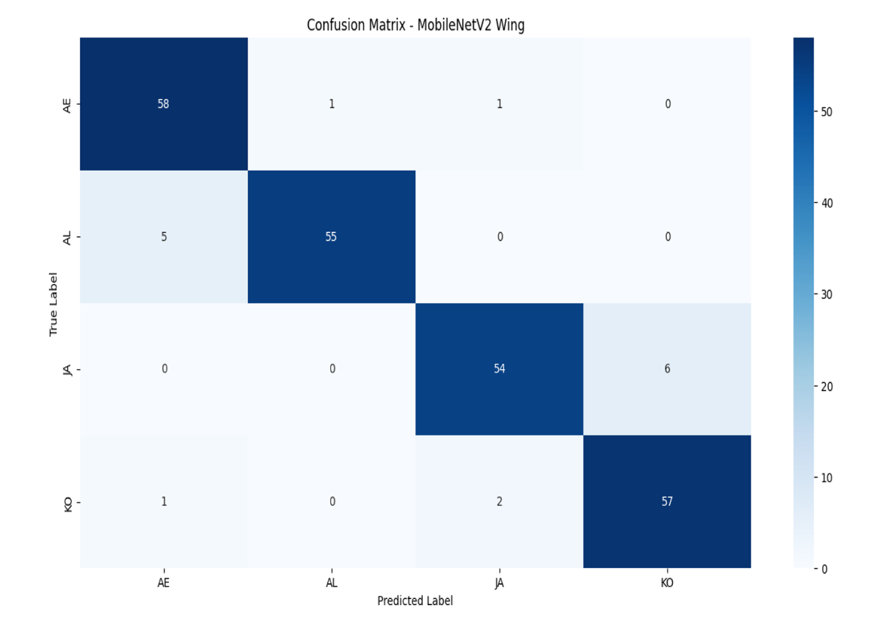

图5. MobileNetV2模型在翅膀图像测试集上的混淆矩阵，行代表真实标签，列代表预测标签

如图6所示，混合模型在躯体图像上的混淆矩阵显示其对不同蚊子物种的分类效果存在差异：日本伊蚊（JA）准确率最高，58个样本正确分类，混淆极少；埃及伊蚊（AE）表现也较好，45个正确预测，但10个样本误分为AL、5个误分为KO，反映出与形态相似物种的混淆；白纹伊蚊（AL）48个正确预测，但存在跨类别分类（3个为AE、4个为JA、5个为KO）；值得注意的是，朝鲜伊蚊（KO）误分类最多，仅40个正确预测，大量样本误分为AL（12个）、JA（4个）和AE（4个）。这些结果表明，尽管混合模型在躯体图像上表现尚可，但类别间（尤其是KO和AL）的形态相似性限制了其整体区分能力。

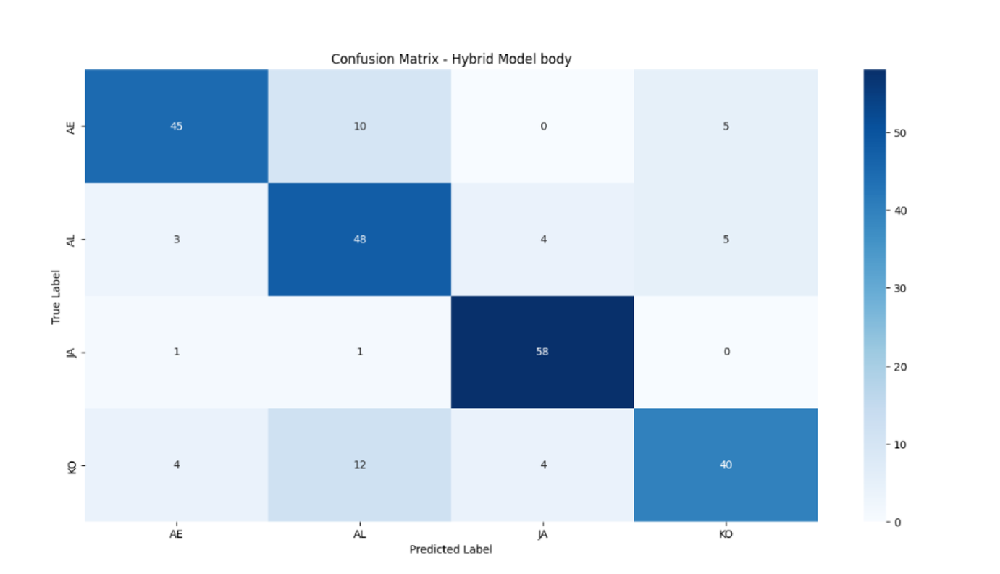

图6. 混合模型在躯体图像测试集上的混淆矩阵，行代表真实标签，列代表预测标签

图7展示混合模型在翅膀图像上的混淆矩阵，与躯体图像相比分类性能显著提升：AE和AL均实现49个正确预测，准确率较高，但11个AE样本和8个AL样本误分为KO，表明翅膀特征仍存在部分重叠；JA 56个正确分类，仅4个样本预测为KO；KO表现极佳，60个样本中59个正确识别。总体而言，误分类率降低和类别准确率提升凸显翅膀图像对混合模型的区分价值，支持“翅膀形态比单一躯体形态提供更可靠物种区分线索”的假设。

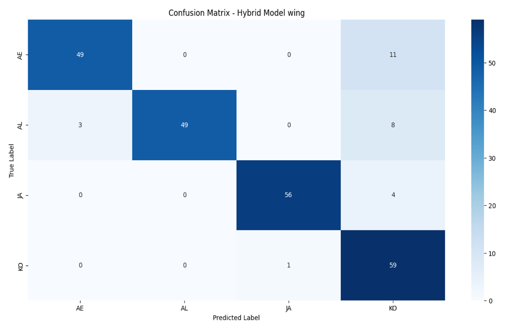

图7. 混合模型在翅膀图像测试集上的混淆矩阵，行代表真实标签，列代表预测标签

## 4.2 学习曲线分析
如图8所示，ResNet50模型的学习曲线清晰表明该架构难以从本数据集有效学习：尽管模型在训练图像上取得微小进展，但在未见过的验证数据上表现较差且极不稳定。躯体图像的验证准确率波动剧烈，无持续提升，表明模型泛化能力差；翅膀图像的结果更不稳定，验证损失出现剧烈峰值，表明模型对数据变异高度敏感，可能存在过拟合。最终，这些模式表明深层复杂的ResNet50架构与本研究相对较小的数据集不匹配——模型对可用数据量而言过于复杂，无法有效学习蚊子图像的关键特征。

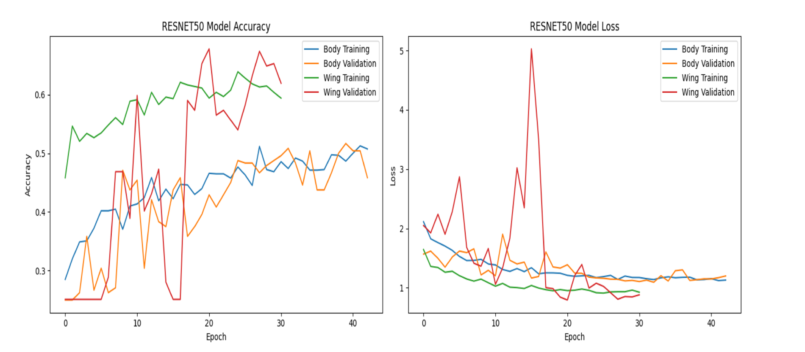

图8. ResNet50模型学习曲线，对比躯体（蓝/橙）和翅膀（绿/红）数据集的训练/验证准确率（左）和损失（右）

如图9所示，MobileNetV2模型的学习曲线通过准确率和损失随时间的变化呈现：模型在翅膀图像上表现极佳，训练和验证准确率均稳步攀升至90%以上，表明模型不仅学习效果好，且泛化能力强；翅膀图像的损失曲线呈持续下降趋势，趋势一致。躯体图像的结果同样优异（略低于翅膀图像）：准确率呈稳定上升趋势，且验证准确率与训练准确率紧密跟踪，表明模型有效避免了过拟合；尽管躯体图像的损失存在轻微波动，但整体呈下降趋势。

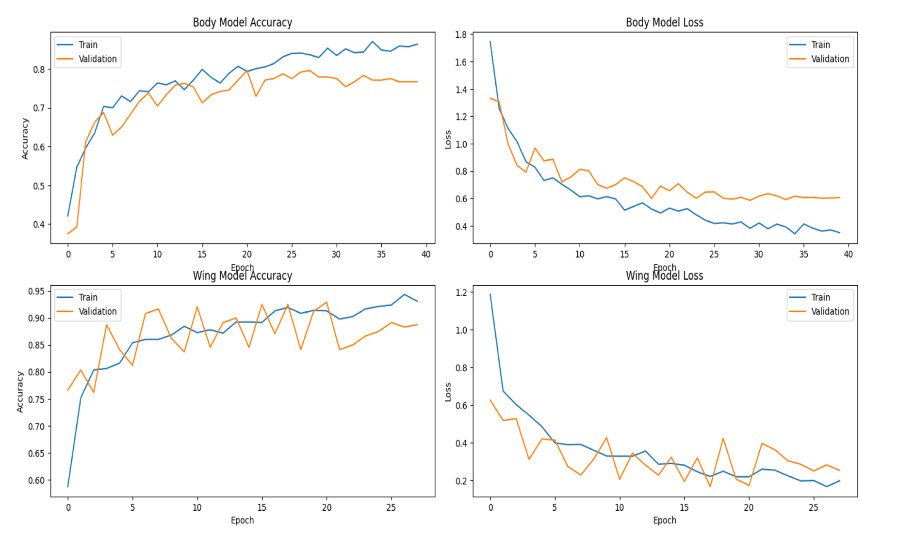

图9. MobileNetV2模型学习曲线，对比训练（蓝）和验证（橙）指标，分为躯体模型准确率/损失（上排）和翅膀模型准确率/损失（下排）

如图10所示，EfficientNetV2模型训练过程中未收敛：躯体和翅膀数据集的准确率曲线在训练轮次中提升极小，维持在25%-30%（四类分类任务中相当于随机猜测水平）；损失曲线同样居高不下且相对平缓。这些现象表明模型可能存在配置不当（如学习率问题）、训练轮次不足或模型复杂度与数据集规模不匹配等问题。模型甚至无法学习基本的区分模式，表明EfficientNetV2未被有效优化用于该任务，或受数据量和变异度限制。

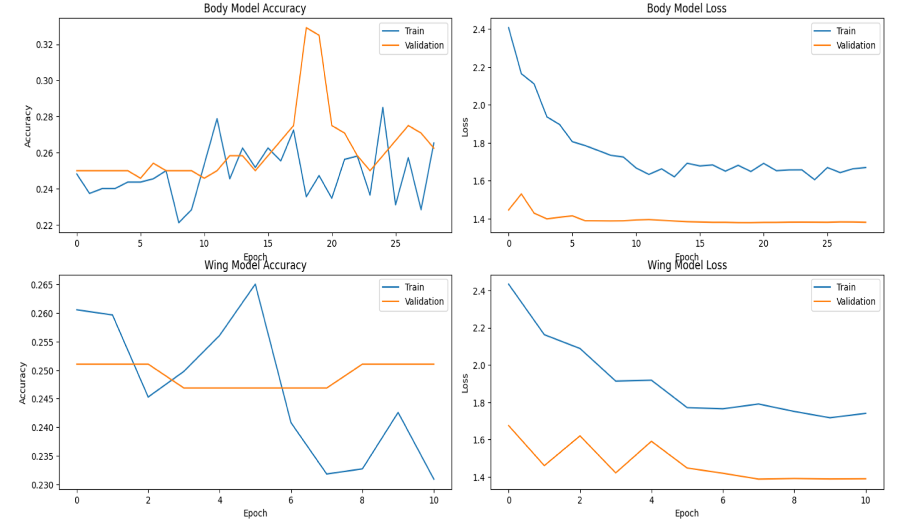

图10. EfficientNetV2模型学习曲线，对比训练（蓝）和验证（橙）指标，分为躯体模型准确率/损失（上排）和翅膀模型准确率/损失（下排）

如图11所示，DenseNet模型在躯体和翅膀数据集上均表现出强劲的训练性能：翅膀图像准确率快速上升并稳定在90%以上（验证集），躯体图像准确率稳定在70%-80%；两类数据集的验证损失持续下降且保持在较低水平，反映出训练过程正则化效果良好，过拟合程度低。这些结果表明DenseNet的密集连接和特征复用架构在有限数据中提取有意义空间特征的有效性，模型的稳定性和泛化能力使其适合数据受限场景下的蚊子物种分类任务。

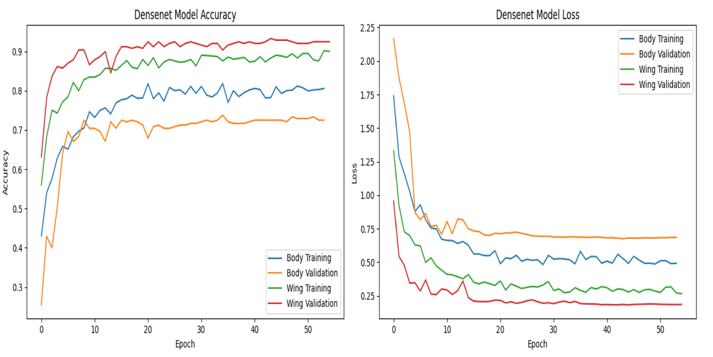

图11. DenseNet模型学习曲线，对比躯体（蓝/橙）和翅膀（绿/红）数据集的训练/验证准确率（左）和损失（右）

如图12所示，自定义CNN模型的训练性能清晰可见：翅膀图像准确率逐步提升至约93%，验证准确率攀升至近90%，表明模型泛化能力强、特征学习有效；躯体图像的训练和验证准确率稳定在80%左右，表现尚可但略逊于翅膀图像；两类数据集的损失曲线持续下降，表明模型收敛效果良好。总体而言，CNN模型表现出色（尤其是翅膀图像），验证了其作为轻量级架构在精细调优后的有效性。

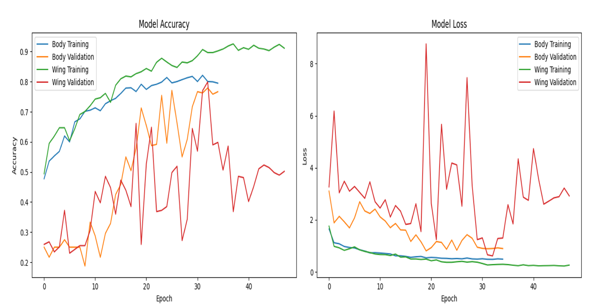

图12. 自定义CNN模型学习曲线，对比躯体（蓝/橙）和翅膀（绿/红）数据集的训练/验证准确率（左）和损失（右）

如图13所示，CNN与MobileNet结合的混合架构在躯体和翅膀数据集上均实现高准确率和稳定性：翅膀图像的训练和验证准确率稳步提升，峰值超过90%；躯体图像准确率略低但保持稳定。损失曲线验证了这些结果：四类损失轨迹（两类图像的训练和验证损失）均持续下降，无重大波动。这种稳定性反映了混合模型在轻量级特征提取与深层模式学习之间的平衡能力，为物种分类提供了实用、准确的解决方案——尤其适用于边缘计算或资源有限场景。

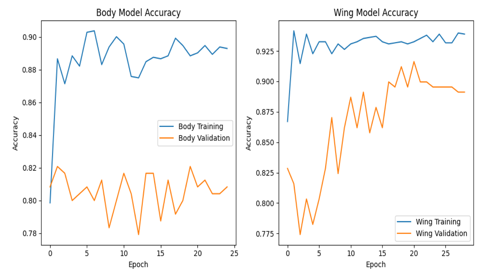

图13. 混合（CNN + MobileNet）模型的训练和验证准确率曲线，对比躯体模型准确率（左）和翅膀模型准确率（右）

## 4.3 ROC 曲线与 AUC 分析
图14a展示六种深度学习模型在躯体图像蚊子物种分类中的ROC曲线，AUC值反映模型的区分能力：
- 混合模型（CNN + MobileNet）：融合自定义CNN和MobileNet优势，以0.96的AUC值位居榜首，表明该混合策略对该任务极为有效；
- MobileNetV2：紧随混合模型之后，AUC值达0.95，证明轻量级高效模型仍能实现顶级性能；
- DenseNet121：表现优异，AUC值0.93，其密集连接层设计使其在识别蚊子躯体细微形态特征方面具有优势；
- CNN：自定义CNN表现强劲，AUC值0.92，证明针对特定任务设计的相对简单架构可实现高效分类；
- ResNet50：性能显著下降，AUC值仅0.79，表明该深层复杂模型难以将学习成果泛化到未见过的新图像；
- EfficientNetB0：表现最差，AUC值0.68，难以基于躯体图像区分不同蚊子物种。

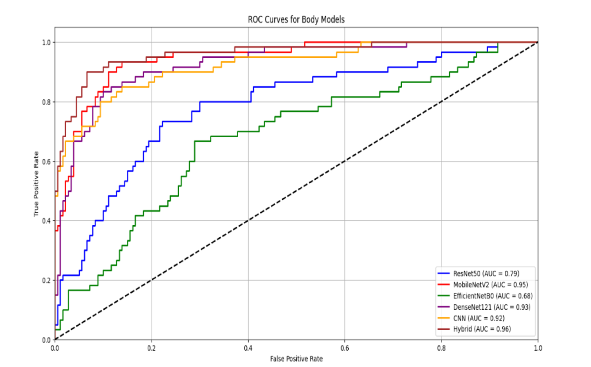

图14a. 所有六种模型在躯体图像测试数据集上的ROC曲线，图例显示各模型的AUC值，混合模型（AUC=0.96）表现最佳

图14b展示相同模型在翅膀图像上的ROC曲线，大多数架构的性能显著优于躯体图像，进一步证实翅膀形态的高区分能力：
- MobileNetV2：该轻量级模型表现最佳，AUC值达0.99（接近完美），其高效架构能精准捕捉昆虫翅膀的精细纹理特征；
- 混合模型（CNN + MobileNet）：分类能力优异，AUC值0.96，证实其在不同图像类型上的强泛化能力；
- DenseNet121：AUC值0.98，凸显模型学习复杂模式并维持类别稳健性的能力；
- CNN：AUC值保持在0.93的高水平，与躯体图像表现一致，证明其在有限结构化图像数据中的学习效率；
- ResNet50：AUC值0.90，表现尚可，且较躯体图像结果显著提升，表明翅膀图像的特征更易被该深层模型学习；
- EfficientNetB0：与其他模型形成鲜明对比，在该任务中彻底失败，AUC值仅0.35（远差于随机猜测），表明其根本无法从翅膀数据中学习有效特征。

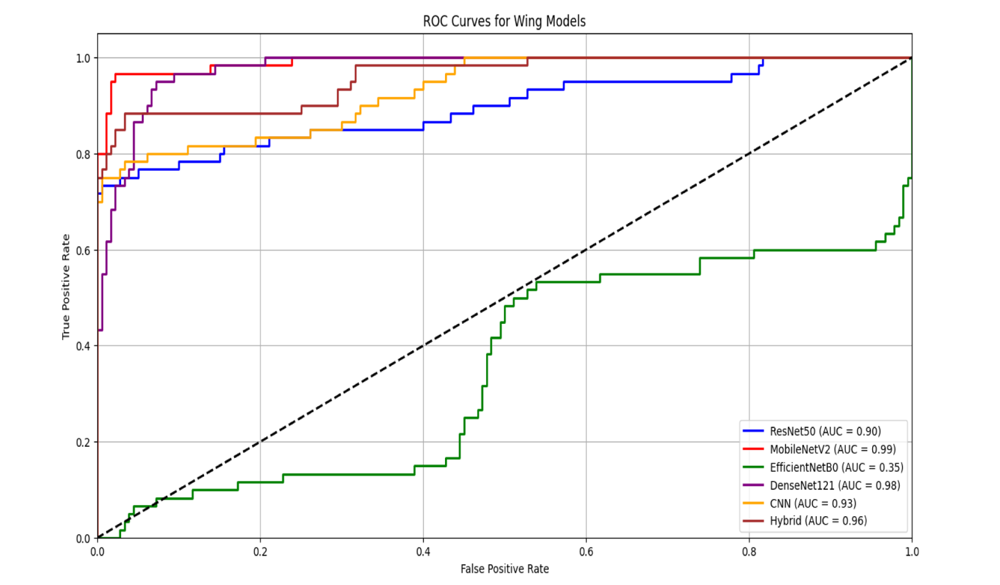

图14b. 所有六种模型在翅膀图像测试数据集上的ROC曲线，图例显示各模型的AUC值，MobileNetV2（AUC=0.99）表现接近完美

## 4.4 关键性能指标汇总

表4a和表4b汇总了所有模型在躯体和翅膀图像上的关键性能指标，表5对比了本研究与Nolte等人[15]的基准结果。

表4a 各模型在躯体图像上的性能指标（详细）
| 模型                 | 准确率（%） | 灵敏度（%） | 精确率（%） | F1 分数（%） | Kappa 值  |
|----------------------|-------------|-------------|-------------|--------------|-----------|
| ResNet50             | 51.3        | 51.3        | 51.3        | 51.2         | 0.3500    |
| MobileNetV2          | 77.5        | 77.5        | 78.3        | 77.4         | 0.7000    |
| EfficientNetV2       | 33.8        | 33.8        | 52.4        | 28.5         | 0.1167    |
| DenseNet121          | 77.1        | 77.1        | 78.4        | 76.9         | 0.6944    |
| CNN                  | 69.2        | 69.2        | 73.8        | 69.8         | 0.5889    |
| 混合模型（CNN + MobileNet） | 79.6        | 79.6        | 80.1        | 79.4         | 0.7278    |

表4b 各模型在翅膀图像上的性能指标（详细）
| 模型                 | 准确率（%） | 灵敏度（%） | 精确率（%） | F1 分数（%） | Kappa 值  |
|----------------------|-------------|-------------|-------------|--------------|-----------|
| ResNet50             | 60.4        | 60.4        | 63.3        | 60.4         | 0.4722    |
| MobileNetV2          | 93.3        | 93.3        | 93.5        | 93.3         | 0.9111    |
| EfficientNetV2       | 25.0        | 25.0        | 6.3         | 10.0         | 0.0000    |
| DenseNet121          | 87.1        | 87.1        | 87.2        | 87.0         | 0.8278    |
| CNN                  | 80.4        | 80.4        | 84.8        | 80.8         | 0.7389    |
| 混合模型（CNN + MobileNet） | 88.8        | 88.8        | 91.1        | 89.1         | 0.8500    |

表5 本研究与Nolte等人[15]的性能对比
| 作者       | 方法         | 数据集                | 翅膀图像准确率 | 躯体图像准确率 |
|------------|--------------|-----------------------|----------------|----------------|
| Nolte等人[15] | CNN          | 796张图像（4种伊蚊）| 87.6%          | 78.9%          |
| 本研究     | MobileNetV2  | 796张图像（4种）| 93.3%          | 77.5%          |
| 本研究     | 混合模型     | 796张图像（4种伊蚊）| 88.8%          | 79.6%          |

## 4.5 结果核心结论

深入分析结果可得出以下关键结论：
1. 图像类型决定模型选择：躯体图像分类的最优解是混合模型（79.6%准确率），翅膀图像分类的最优解是MobileNetV2（93.3%准确率）；
2. 翅膀图像区分能力更强：所有模型在翅膀图像上的性能均优于躯体图像，因翅膀的物种特异性脉序和纹理更稳定；
3. 轻量型模型优势显著：MobileNetV2和DenseNet121在性能和计算效率上实现平衡，适配野外资源有限场景；
4. 深层模型适配性差：ResNet50和EfficientNetV2因数据集规模小而出现过拟合或未收敛，证明“模型复杂度需与数据量匹配”；
5. 本研究性能优于基准：MobileNetV2的翅膀图像准确率（93.3%）和混合模型的躯体图像准确率（79.6%）均超越Nolte等人的CNN模型。

## 解读

实验结果部分通过“定量指标+定性分析”结合的方式，全面验证研究假设，核心发现清晰明确：
1. 图像类型的影响：**翅膀图像的分类性能普遍优于躯体图像**（所有模型的翅膀图像准确率均高于躯体图像），原因是翅膀的物种特异性脉序和纹理更稳定、区分度更高，尤其适用于形态相似的伊蚊物种，这一结果与前人研究一致性且性能更优；
2. 模型性能差异：
   - 轻量型模型（MobileNetV2、DenseNet121）表现突出：MobileNetV2在翅膀图像上达到93.3%准确率（AUC=0.99），DenseNet121在两类图像上均保持稳定高准确率，证明轻量型架构在“性能与计算效率”上的平衡优势，适配野外应用；
   - 混合模型在躯体图像上最优（79.6%准确率，AUC=0.96），融合两种模型的特征优势，解决了躯体图像特征区分度不足的问题，验证了混合架构的创新价值；
   - 深层模型（ResNet50）表现不佳：因数据集规模较小，深层模型出现过拟合，泛化能力差；EfficientNetV2彻底失败（翅膀图像AUC=0.35），说明模型复杂度需与数据集规模、任务特性匹配，并非“越先进越好”；
   - 自定义CNN表现稳健：虽非最优，但在两类图像上均达到较高准确率（翅膀80.4%、躯体69.2%），证明针对特定任务的简单架构的实用价值；
3. 与前人研究对比：本研究的MobileNetV2（翅膀93.3%）和混合模型（躯体79.6%）均优于Nolte等人的CNN模型（翅膀87.6%、躯体78.9%），凸显模型架构优化的有效性；
4. 核心结论：不同图像类型需匹配不同模型——躯体图像适配混合模型，翅膀图像适配MobileNetV2，为实际应用提供了明确的技术选型依据。

# 五、Discussion—讨论
## 翻译
本研究将深度学习和混合方法应用于蚊子分类，结果凸显图像类型（躯体vs翅膀）对模型整体性能和可靠性的显著影响。研究评估了CNN、ResNet50、MobileNetV2、EfficientNetV2、DenseNet121和提出的混合模型的分类性能，发现MobileNetV2模型在翅膀图像上实现最高分类准确率，混合模型在躯体图像上表现最佳。值得注意的是，所有模型在翅膀图像上的分类结果均优于躯体图像，凸显翅膀形态的区分能力——这与文献[17]的先前结论一致。

与早期研究相比，本研究结果具有竞争力：Nolte等人[15]使用CNN模型对相似蚊子物种进行分类，翅膀图像准确率87.6%，躯体图像78.9%，而本研究的MobileNetV2模型在翅膀图像上显著超越该水平（表5）。类似地，Araújo等人[2]采用AlexNet实现94%准确率，本研究的MobileNetV2模型表现接近；Johnson等人[9]提出的EggCountRFS模型在基于EfficientNet的准确率表现出高准确率，但该研究聚焦卵分类而非成蚊分类。近期采用Faster R-CNN[21]、CNN+RIFS[22]、轻基EfficientNetV2等架构（结合知识蒸馏和残差跳跃块）[13]等复杂模型的研究均取得了良好性能。本研究结果证实，MobileNetV2等轻量型架构可在降低计算成本的同时显著提升分类性能，与Montalbo[13]提出的“效率优先”设计原则一致。

与Minakshi等人[12]的大规模数据集研究（25667张蚊子图像，Inception-ResNet V2架构，准确率80%）相比，本研究的模型尽管数据集规模相对较小，但泛化能力更优，表明精心的模型设计和混合策略可有效弥补数据量不足的缺陷。Adhane等人[1]讨论的迁移学习方法和Swin Transformer[24]、MobileNetV1[10]等基于视觉Transformer的架构均为蚊子分类任务设定了新标准，实现了近完美结果。尽管本研究采用Transformer-based模型，但MobileNetV2和混合模型仍取得了高性能，表明未来通过整合此类先进技术有望进一步提升性能。

本研究的重要贡献之一是对躯体和翅膀图像的系统对比，清晰证实翅膀图像对物种分类任务更具信息价值。这一发现凸显翅膀形态在蚊子物种区分中的重要性，为未来更准确的蚊子图像监测提供了参考。

本研究的一项关键发现是ResNet50（图8）和EfficientNetV2（图10）等深层、参数过多的模型的明显失败。这些复杂架构在训练于相对小型、专用数据集时可能出现过拟合，尽管它们在ImageNet等大型数据集上表现强劲，但在有限的蚊子图像中可能学习到虚假特征。相比之下，轻量型MobileNetV2（图9）和自定义CNN（图4）的架构更适配数据量，能够有效泛化。

尽管如此，本研究仍存在局限性：数据集规模相对较小，成像条件的变异可能对躯体图像质量产生显著影响，进而影响部分模型的性能。未来研究应聚焦于扩大数据集、实现先进数据增强技术、探索Transformer-based模型，以进一步提升分类性能。

本研究同样承认，所用数据集虽标准化，但仅包含受控光照下的完整样本，因此本研究报告的高准确率代表理想条件下的上限。未来研究必须在真实野外采集的（可能受损或遮挡的）样本上验证这些模型，以评估其实际应用就绪度。

总体而言，本研究证明深度学习模型（尤其是轻量型架构和混合方法）可实现高准确率的蚊子物种分类，为开发可扩展的自动媒介监测系统提供了潜力。

## 解读
讨论部分是对实验结果的深度延伸，遵循“结果总结→横向对比→贡献提炼→局限性分析→未来方向”的逻辑：
1. 结果总结：重申核心发现——图像类型影响模型选择（混合模型适配躯体图像，MobileNetV2适配翅膀图像），翅膀图像区分度更高，轻量型模型优势显著；
2. 横向对比：将本研究结果与近5年相关研究对比，凸显性能优势（如MobileNetV2翅膀图像准确率93.3%优于Nolte等人的87.6%），同时强调本研究的独特价值——针对形态相似伊蚊，系统对比两种图像类型，提升模型的适用场景；
3. 贡献提炼：明确两大核心贡献——①证实翅膀图像的高信息价值，为监测技术选型提供依据；②验证轻量型和混合模型的有效性，解决“大规模部署”的计算成本问题；
4. 深度分析：解释深层模型（ResNet50、EfficientNetV2）失败的本质原因——数据集规模与模型复杂度不匹配，导致过拟合，为后续模型选择提供理论指导；
5. 局限性与未来方向：客观指出数据集规模小、样本场景单一（受控环境）等不足，提出具体改进方向（扩大数据集、先进数据增强、Transformer模型、野外样本验证），体现研究的严谨性和前瞻性。

# 六、Conclusion—结论
## 翻译
本研究通过深度学习方法分析了蚊子躯体形态和翅膀形态对物种鉴定的具体贡献。结果表明，模型的成功在很大程度上取决于可用视觉数据——躯体和翅膀图像需要独特的架构方法。CNN与MobileNetV2架构结合在躯体图像上实现了最高鉴定准确率，而MobileNetV2单独在翅膀图像上表现最佳（因翅膀形态与躯体结构存在本质差异）。

研究结果对媒介监测工作具有重要意义：实际部署中，若能获取完整躯体图像，可采用CNN-MobileNetV2混合系统（本研究中表现出强劲准确率）；通过翅膀脉序识别精细形态结构的场景，MobileNetV2轻量型模型更为适配——其具备在移动设备野外场景中快速运行的潜力。然而，如局限性部分所述，翅膀样本的制备时间以及标准化成像的需求，仍是在全球各地部署的实际挑战。

本研究的发现存在一定局限性，影响其普适性：研究数据集主要包含统一物种样本和标准化成像条件，而实际媒介监测系统面临多样化场景；模型在受控测试环境中运行，其在野外样本上的性能尚未经过真实场景验证；翅膀识别所需的高质量标准化图像，在资源有限地区部署时面临障碍。

未来研究应直接解决这些现有局限性：增加更多物种样本、整合多样化成像设备和野外数据收集，以提升系统稳健性；在不同环境预测条件下样本质量特征对直接进行野外测试，评估其实际部署潜力；将昆虫学专业知识融入解读过程，使AI预测与分类学关键特征直接相关；通过多模态方法整合躯体和翅膀图像分析、栖息地数据、环境条件及地理分布信息，开发更完善的全球蚊子监测工具。

未来研究需要将技术系统开发与生物学需求、实际应用需求相结合，打造可部署的AI系统，以改进媒介控制和疾病预防策略。

## 解读
结论部分对研究进行了高度概括与升华，核心包含三层逻辑：
1. 核心发现总结：明确“两种图像决定模型差异”的核心结论——混合模型适配躯体图像，MobileNetV2适配翅膀图像，体现翅膀形态的高分类指导价值；
2. 实际应用价值：将研究结果落地到媒介监测场景，给出具体技术选型建议（混合模型用于躯体图像，MobileNetV2用于翅膀图像），同时客观指出部署挑战（翅膀样本制备、标准化成像）；
3. 局限性与未来展望：再次强调数据集和测试环境的局限性，提出更具针对性的未来研究方向（多模态融合、昆虫学知识整合、野外验证），最终目标是打造“技术-生物-应用”三位一体的可部署AI系统，服务于全球蚊媒疾病防控。

# 作者贡献声明
Talaa Ormnekaya：方法学、验证、可视化、初稿撰写、审阅与编辑。
Me'ta Ya'gci'：数据整理、方法学、验证、可视化、初稿撰写、审阅与编辑。

# 利益冲突声明
作者声明无可能影响本研究结果的财务利益冲突或个人关系。

# 数据可用性
本研究使用和/或分析的数据集可通过联系通讯作者合理获取。

# 参考文献
1. G. Adhane, M.M. Dehshibi, D. Masip, A deep convolutional neural network for classification of Aedes albopictus mosquitoes, IEEE Access 9 (2021) 72681–72690, [https://doi.org/10.1109/ACCESS.2021.3079700](https://doi.org/10.1109/ACCESS.2021.3079700).
2. T.O. Araújo, V.L. de Miranda, R. Gurgel-Gonçalves, AI-driven convolutional neural networks for accurate identification of yellow fever vectors, Parasit. Vectors 17 (2024) 329, [https://doi.org/10.1186/s13071-024-06406-2](https://doi.org/10.1186/s13071-024-06406-2).
3. R. Charoenpanyaku, V. Kittichai, S. Eiamsamang, et al., Enhancing mosquito classification through self-supervised learning, Sci. Rep. 14 (2024) 27123, [https://doi.org/10.1038/s41598-024-72826-2](https://doi.org/10.1038/s41598-024-72826-2).
4. W.M. de Souza, S.C. Weaver, Effects of climate change and human activities on vector-borne diseases, Nat. Rev. Microbiol. 22 (2024) 476–491, [https://doi.org/10.1038/s41579-024-01026-0](https://doi.org/10.1038/s41579-024-01026-0).
5. K.A. Gupta, V.N. Ikonomidou, M. Glancey, R. Faiman, S. Talafta, T. Ford, T. Jenkins, A. Goodwin, Mosquito species identification accuracy of early deployed algorithms in IDx, a vector identification tool, Acta Trop. 260 (2024) 107392, [https://doi.org/10.1016/j.actatropica.2024.107392](https://doi.org/10.1016/j.actatropica.2024.107392).
6. K. He, X. Zhang, S. Ren, J. Sun, Deep residual learning for image recognition (arXiv:1512.03385), ArXiv (2015), [https://doi.org/10.1109/CVPR.2016.90](https://doi.org/10.1109/CVPR.2016.90).
7. A.G. Howard, M. Zhu, B. Chen, D. Kalenichenko, W. Wang, W. David, MobileNets: efficient convolutional neural networks for mobile vision applications, ArXiv (2017), [https://doi.org/10.48550/arXiv.1704.04861](https://doi.org/10.48550/arXiv.1704.04861).
8. G. Huang, Z. Liu, L. Van Der Maaten, K.Q. Weinberger, Densely connected convolutional networks, in: Proceedings of the IEEE conference on computer vision and pattern recognition, 2017, pp. 4700–4708, [https://doi.org/10.1109/CVPR.2017.243](https://doi.org/10.1109/CVPR.2017.243).
9. L. Johnson, R. Patel, K. Wong, EggCountAI: a convolutional neural network-based software for automatic counting of Aedes aegypti mosquito eggs. Parasites & Vectors, Springer, 2023, [https://doi.org/10.1186/s13071-023-05688-2](https://doi.org/10.1186/s13071-023-05688-2).
10. A.A.J. Karim, M.Z. Mahmud, R. Khan, Advanced vision transformers and open-set learning for robust mosquito classification: a novel approach to entomological studies, PLoS Comput. Biol. 20 (12) (2024) e1012654, [https://doi.org/10.1371/journal.pcbi.1012654](https://doi.org/10.1371/journal.pcbi.1012654).
11. Y. LeCun, Y. Bengio, G. Hinton, Deep learning, Nature 521 (7553) (2015) 436–444, [https://doi.org/10.1038/nature14539](https://doi.org/10.1038/nature14539).
12. M. Minakshi, P. Bharti, W.B. McClinton III, J. Mirzakhalov, R.M. Carney, S. Chellappan, Automating the surveillance of mosquito vectors from trapped specimens using computer vision techniques, ArXiv (2020), [https://doi.org/10.48550/arXiv.2005.12188](https://doi.org/10.48550/arXiv.2005.12188).
13. E.J.P. Montalbo, Automating mosquito taxonomy by compressing and enhancing a feature fused EfficientNet with knowledge distillation and a novel residual skip block, MethodsX 10 (2023) 102072, [https://doi.org/10.1016/j.mex.2023.102072](https://doi.org/10.1016/j.mex.2023.102072).
14. A. Nebbak, L. Almeras, P. Parola, I. Bitam, Mosquito vectors (Diptera: culicidae) and mosquito-borne diseases in North Africa, Insects 13 (10) (2022) 962, [https://doi.org/10.3390/insects13100962](https://doi.org/10.3390/insects13100962).
15. K. Nolte, F.G. Sauer, J. Baumbach, P. Kollmannsberger, C. Lins, R. Lühken, Robust mosquito species identification from diverse body and wing images using deep learning, Parasit. Vectors 17 (1) (2024) 372, [https://doi.org/10.5061/dryad.b8gth7mx](https://doi.org/10.5061/dryad.b8gth7mx).
16. F.G. Sauer, L. Jaworski, L. Erdbeer, et al., Geometric morphometric wing analysis represents a robust tool to identify female mosquitoes (Diptera: culicidae) in Germany, Sci. Rep. 10 (2020) 17613, [https://doi.org/10.1038/s41598-020-72873-z](https://doi.org/10.1038/s41598-020-72873-z).
17. F.G. Sauer, M. Werny, K. Nolte, et al., A convolutional neural network to identify mosquito species (Diptera: culicidae) of the genus Aedes by wing images, Sci. Rep. 14 (2024) 3094, [https://doi.org/10.1038/s41598-024-53631-x](https://doi.org/10.1038/s41598-024-53631-x).
18. D. Singh, Y.S. Taspinar, R. Kursun, I. Cinar, M. Koklu, I.A. Ozkan, H.-N. Lee, Classification and analysis of pistachio species with pre-trained deep learning models, Electronics. (Basel) 11 (6) (2022) 981, [https://doi.org/10.3390/electronics11070981](https://doi.org/10.3390/electronics11070981).
19. M. Tan, Q.V. Le, A. Paul, EfficientNet: rethinking model scaling for convolutional neural networks (arXiv:1905.11946), ArXiv. (2019), [https://doi.org/10.48550/arXiv.1905.11946](https://doi.org/10.48550/arXiv.1905.11946).
20. Y.S. Taspinar, I. Cinar, M. Koklu, Classification by a stacking model using CNN features for COVID-19 infection diagnosis, J. Xray. Sci. Technol. 30 (1) (2021) 73–88, [https://doi.org/10.3233/XST-211031](https://doi.org/10.3233/XST-211031).
21. M. Wang, Y. Zhou, S. Yao, J. Wu, M. Zhu, L. Dong, D. Wang, Enhancing vector control: AI-based identification and counting of Aedes albopictus (Diptera: culicidae) mosquito eggs, Parasit. Vectors 17 (1) (2024) 511, [https://doi.org/10.1186/s13071-024-06587-w](https://doi.org/10.1186/s13071-024-06587-w).
22. S. Wang, D. Patel, Vector mosquito image classification using novel RIFS feature extraction, Pattern Recognition Letters, Elsevier, 2023, [https://doi.org/10.1016/j.patrec.2023.07.012](https://doi.org/10.1016/j.patrec.2023.07.012).
23. World Health Organization (WHO), Global Report On Neglected Tropical Diseases 2024, World Health Organization, 2024. [https://www.who.int/publications/i/item/9789240091535](https://www.who.int/publications/i/item/9789240091535).
24. Dz. Zhao, Xk. Wang, T. Zhao, et al., A Swin Transformer-based model for mosquito species identification, Sci. Rep. 12 (2022) 18664, [https://doi.org/10.1038/s41598-022-21017-6](https://doi.org/10.1038/s41598-022-21017-6).
